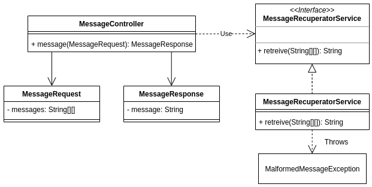
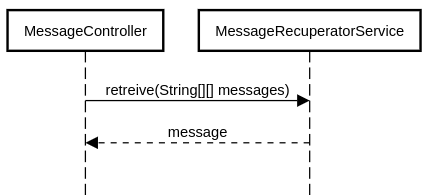

# DESAFIO TÉCNICO - MELI
## Operación de fuego quasar

## message-api

### Objetivo
Esta API tiene como fin brindar el servicio para recuperar el mensaje formado por 3 Strings.

### Especificación

#### Tecnologías
Las tecnologías que se utilizaron son:
- Java 1.8
- Maven
- SpringBoot

La API se encuentra hosteada en **heroku**, que es un servicio de hosting que brinda opciones para hostear APIs de manera gratuita. Para más información puede ingresar a www.heroku.com.

**URL del servicio: https://salva-message-api.herokuapp.com/messages**

#### Llamadas provistas
Realizando un POST a la URL https://salva-message-api.herokuapp.com/messages se recibe como respuesta el mensaje recuperado.

#### Ejemplo del Body del POST

```JSON
{
  "messages": [
    ["este", " ", " ", "mensaje", " "],
    [" ", "es", " ", " ", "secreto"],
    ["este", " ", "un", " ", " "]
  ]
}
```
Y el Response con código 200 y body:
```JSON
{
    "message": "este es un mensaje secreto"
}
```
En caso de no poderse determinar el mensaje, se retorna un response con mensaje de error y código 404.

### Diagramas

#### Diagrama de Clases


#### Diagrama de Secuencia
##### Recuperación de mensaje - flujo normal

